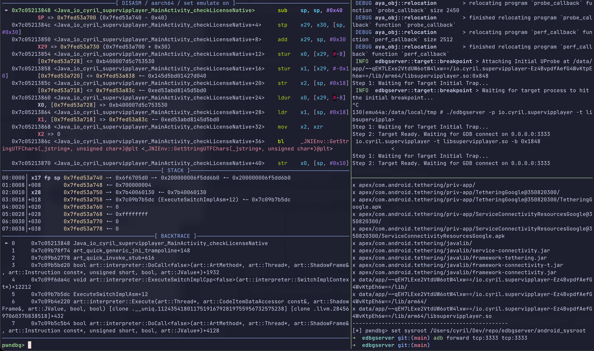

# edbgserver

[English](README.md) | [中文](README_zh.md)

An eBPF-powered debugger server designed to achieve minimal intrusive characteristics by bypassing the `ptrace` system call. Currently supports **Arm64** and **x86_64** architectures on **Android** and **Linux**.



## Acknowledgments

Special thanks to [ShinoLeah](https://github.com/ShinoLeah) for the project [eDBG](https://github.com/ShinoLeah/eDBG). This project derives its name and core principles from eDBG. If you find this tool helpful, please consider giving [eDBG](https://github.com/ShinoLeah/eDBG) a star as well.

## Features

- Hardware and software breakpoints.
- Single-stepping (Step-over/Step-into, implementation depends on GDB logic).
- Signal delivery.
- Reading and modifying arbitrary memory addresses.
- Register reading.
- Reading and modifying files.
- Process library information retrieval (symbol information).
- Multi-thread debugging support (defaults to single-thread mode).

## Limitations

- **Register Modification**: Due to eBPF constraints, CPU register values cannot be modified directly (can be bypassed using the `patch` command).
- **Multi-threading**: Currently unable to read registers of threads other than the one that triggered the breakpoint (Work in Progress).
- **Attachment**: Cannot "attach" to a running process immediately; must set an initial file breakpoint first (Work in Progress).
- **Namespace Isolation**: Since eBPF programs run in kernel space and are unaware of namespaces, it is recommended **not** to run this in isolated environments like WSL or Docker, as thread IDs (TIDs) may be inaccurate. Linux VMs and Android `adb shell` are unaffected.
- **Stability**: Single-stepping on `x86_64` has not been fully tested and may contain bugs.

## Usage

```sh
edbgserver [OPTIONS] --target <TARGET> --break <BREAK_POINT>

Options:
  -t, --target <TARGET>      Path to the target binary or library
  -p, --package <PACKAGE>    [Android only] The package name of target application
  -b, --break <BREAK_POINT>  The initial breakpoint address (virtual address). The server will set a UProbe at this location to intercept execution and wait for GDB. Supports hexadecimal (e.g., 0x400000) or decimal input
      --port <PORT>          The TCP port where the GDB server will listen for incoming connections [default: 3333]
  -u, --uds [<UDS>]          Use Unix Domain Socket instead of TCP. If the path starts with '@', it is treated as an Abstract Namespace Socket. If no value is provided, it defaults to the abstract socket "@edbg"
  -P, --pid <PID>            The Process ID (PID) of the target process to attach to. If omitted, the server will automatically attach to the first process that triggers the breakpoint in the specified binary
  -m, --multi-thread         Run the server in multi-threaded mode
      --no-filter            Disable filtering of memory maps when attaching to the target process. By default, the server filters out irrelevant memory maps to improve performance
      --use-uprobe           force using uprobe implementation for single-step (perf by default)
  -h, --help                 Print help (see more with '--help')
  -V, --version              Print version

```

- **target**: Path to the target file. It must be discoverable by uprobe. For Android `.so` files, providing the filename is sufficient.
- **package**: Android Target application package name. Required if debugging a `.so` within an app (unless providing an absolute path to the `.so`).
- **break**: Initial breakpoint address. This must be a **Virtual Address** (the address shown on the left side in IDA), not the file offset.
- **pid**: Filter the initial breakpoint by a specific Process ID.
- **port**: TCP port (default: 3333). Remember to use `adb forward` for Android.
- **uds**: Use Unix Domain Sockets for slightly better performance. Abstract namespaces (starting with `@`) are supported.
- **multi-thread**: Reports multi-threading info to GDB. If you are only tracing a single thread, keeping this off is recommended for simplicity.
- **no-filter**: Disables memory map filtering. Enabling this may cause severe performance degradation. Use this only if `vmmap` fails to show information.
- **use-uprobe**: Forces uprobe for single-stepping (the default uses a hybrid strategy of `perf` and `uprobe`).

### Examples

**Basic Android Debugging:**

```sh
./edbgserver -u -p io.cyril.supervipplayer -t libsupervipplayer.so -b 0x1848
adb forward tcp:3333 localabstract:edbg
pwndbg
pwndbg> target remote :3333
pwndbg> breakrva 0x18A8 libsupervipplayer.so
```

**Optimization for Android:**
Pulling libraries from the device during debugging can be extremely slow. Use the `android_lib_pull.sh` script in the root directory to batch-pull common libraries and the target APK's libs to your local machine:

```sh
./android_lib_pull.sh io.cyril.supervipplayer
pwndbg
pwndbg> set sysroot android_sysroot/
pwndbg> set breakpoint auto-hw on
pwndbg> target remote :3333
```

## Installation

Download the corresponding binary for your architecture from the **Releases** page. The program is statically built with `musl` and requires no additional dependencies.

## Building from Source

### Prerequisites

1. Install rustup: `curl --proto '=https' --tlsv1.2 -sSf https://sh.rustup.rs | sh`
2. Install Stable Rust: `rustup toolchain install stable`
3. Install Nightly Rust: `rustup toolchain install nightly --component rust-src`
4. Add target architecture: `rustup target add ${ARCH}-unknown-linux-musl`
5. Install LLVM:
    - **macOS**: `brew install llvm` (and add to PATH)
    - **Linux**: `bash -c "$(wget -O - https://apt.llvm.org/llvm.sh)"`
6. Install musl C toolchain:
    - **macOS**: `brew install filosottile/musl-cross/musl-cross`
    - **Linux**: Download and add `aarch64-linux-musl-cross.tgz` or `x86_64-linux-musl-cross.tgz` to your PATH.
7. Install bpf-linker: `cargo install bpf-linker`

### Build Commands

The project uses build scripts to automatically compile eBPF code and link it (based on the `aya` framework).

```sh
cargo check --target x86_64-unknown-linux-musl
cargo run --release --target aarch64-unknown-linux-musl
cargo build --release --target aarch64-unknown-linux-musl
```

_Note: Refer to `.cargo/config.toml` for cross-compilation configurations._

## License

With the exception of eBPF code, edbgserver is distributed under the terms
of either the [MIT license] or the [Apache License] (version 2.0), at your
option.

Unless you explicitly state otherwise, any contribution intentionally submitted
for inclusion in this crate by you, as defined in the Apache-2.0 license, shall
be dual licensed as above, without any additional terms or conditions.

### eBPF

All eBPF code is distributed under either the terms of the
[GNU General Public License, Version 2] or the [MIT license], at your
option.

Unless you explicitly state otherwise, any contribution intentionally submitted
for inclusion in this project by you, as defined in the GPL-2 license, shall be
dual licensed as above, without any additional terms or conditions.

[Apache license]: LICENSE-APACHE
[MIT license]: LICENSE-MIT
[GNU General Public License, Version 2]: LICENSE-GPL2
